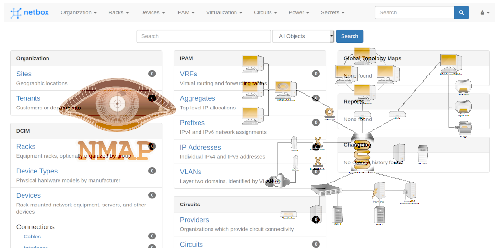

[](https://codecov.io/gh/guanana/netbox-sync-physical-hosts)
<br />
<p align="center">
  <a href="https://github.com/guanana/netbox-sync-physical-hosts">
    
  </a>

  <h3 align="center">netbox-sync-physical-hosts</h3>

  <p align="center">
    Scan your network and populate info to Netbox, fast and reliable
    <br />
    <a href="https://github.com/guanana/netbox-sync-physical-hosts/issues">Report Bug</a>
    ·
    <a href="https://github.com/guanana/netbox-sync-physical-hosts/issues">Request Feature</a>
  </p>

<!-- TABLE OF CONTENTS -->
<details open="open">
  <summary><h2 style="display: inline-block">Table of Contents</h2></summary>
  <ol>
    <li>
      <a href="#about-the-project">About The Project</a>
      <ul>
        <li><a href="#built-with">Built With</a></li>
      </ul>
    </li>
    <li>
      <a href="#getting-started">Getting Started</a>
      <ul>
        <li><a href="#prerequisites">Prerequisites</a></li>
        <li><a href="#installation">Installation</a></li>
      </ul>
    </li>
    <li><a href="#usage">Usage</a></li>
    <li><a href="#contributing">Contributing</a></li>
    <li><a href="#license">License</a></li>
  </ol>
</details>

<!-- ABOUT THE PROJECT -->
## About The Project
The project is meant to be as stable as robust as possible. 
There's a reason behind Netbox project not wanting to create a scanner, if you use Netbox it is recommended
to be your `source of truth`. In order to make that statement true we need to make sure Netbox doesn't contain
outdated, not acurate or not useful info. 
This script aims to keep things as simple as possible and pre-populate info into Netbox to make your life easier.

It's recommended to first run the script pointing at a dev instance of Netbox first. This project tries to populate
info in a safe way but there's never 100% certainty and things can get ugly if you run this script directly in prod
and something goes wrong.
Because automated source of truth can be handy sometimes ;-)

### Built With

* [Python](https://www.python.org/)
* [PyNetbox](https://github.com/digitalocean/pynetbox)
* [python3-nmap](https://pypi.org/project/python3-nmap/)


<!-- GETTING STARTED -->
## Getting Started

To get a local copy up and running follow these simple steps.

### Prerequisites

This script works with Netbox >= 2.9 and python >=3.6 
In order to run the software you just need to install the requirement.
* python >= 3.6
  ```sh
  pip install -r requirements.txt
  ```

### Installation

1. Clone the repo
   ```sh
   git clone https://github.com/guanana/netbox-sync-physical-hosts.git
   ```
2. Install python packages
  ```sh
  pip install -r requirements.txt
  ```


<!-- USAGE EXAMPLES -->
## Usage

The script can be run with multiple configuration options. 
Most of the configuration options can be overwrite using environment variables
```buildoutcfg
[GENERAL]
clenaup: false
tag: nmap-sync

[NETBOX]
nb_url: http://your-server-here:your-port-here
nb_token: your-token-here
nb_ignore-tls-errors: false

[NMAP]
get_mac = true
get_services = false
networks: your-networks-separated-by-comma-here ie: (192.168.4.0/24,192.168.3.0/24)
```
```shell
export NETBOX_URL=http://your-server-here:your-port-here
export NETBOX_TOKEN=your-token-here
export NETWORKS=your-networks-separated-by-comma-here
```

###Get Services

Be aware that if you activate get service option `it will take between 15sec and 30sec per host` (so it can be slow)

###Get Mac

This service is pretty fast but will only work if the scan is performed from the same subnet 
ie: scanning subnet `192.168.1.0/24` from `192.168.1.2`

###Help

```sh
 python netbox-sync.py --help
usage: netbox-sync.py [-h] [-c CONFIG] -u NB_URL [-l L] -p NB_TOKEN [-x] [-f] [-t TAG] -n NETWORKS [-o] [-s]

Args that start with '--' (eg. -u) can also be set in a config file (./Netbox-sync-physical-hosts/netbox-sync-physical-hosts/netbox-
sync.conf or specified via -c). Config file syntax allows: key=value, flag=true, stuff=[a,b,c] (for details, see syntax at https://goo.gl/R74nmi). If an arg is specified
in more than one place, then commandline values override environment variables which override config file values which override defaults.

optional arguments:
  -h, --help            show this help message and exit
  -c CONFIG, --config CONFIG
                        Config file path
  -u NB_URL, --nb_url NB_URL
                        Netbox URL [env var: NETBOX_URL]
  -l L                  log level [env var: LOG_LEVEL]
  -p NB_TOKEN, --nb_token NB_TOKEN
                        Token for Netbox connection [env var: NETBOX_TOKEN]
  -x, --nb_ignore-tls-errors
                        Ignore TLS conection errors
  -f, --clenaup         Cleanup orphans
  -t TAG, --tag TAG     Tag to use for device identification [env var: TAG]
  -n NETWORKS, --networks NETWORKS
                        Networks/Hosts to scan [env var: NETWORKS]
  -o, --get_mac         Enable if you want the script to try to collect MAC addresses/vendor [env var: MAC_DISCOVER]
  -s, --get_services    Enable if you want the script to discover host services [env var: SERVICE_DISCOVER]
```

<!-- CONTRIBUTING -->
## Contributing

Contributions are what make the open source community such an amazing place to be learn, inspire, and create. 
Any contributions you make are **greatly appreciated**.

1. Fork the Project
2. Create your Feature Branch (`git checkout -b feature/AmazingFeature`)
3. Commit your Changes (`git commit -m 'Add some AmazingFeature'`)
4. Push to the Branch (`git push origin feature/AmazingFeature`)
5. Open a Pull Request


<!-- LICENSE -->
## License

Distributed under the GNU General Public License v3.0. 
See <a href="https://github.com/guanana/netbox-sync-physical-hosts/blob/main/LICENSE"><strong>LICENSE</strong></a> for more information.
    

